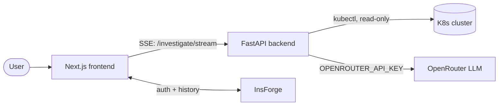

# AI Kubernetes Agent

An **on-demand AI Kubernetes troubleshooting agent**. A user clicks "Investigate", the
backend gathers read-only evidence from a cluster, an LLM reasons over it like a senior
SRE, and the user gets a root cause and a suggested fix. It is not a controller or
operator — every investigation is triggered by an explicit user action.

See [`docs/ARCHITECTURE.md`](docs/ARCHITECTURE.md) for how it all fits together (with
diagrams), [`CLAUDE.md`](CLAUDE.md) for standing rules, and [`docs/PLAN.md`](docs/PLAN.md)
for the roadmap.

## Stack

- **Backend:** Python 3.12+, FastAPI, Uvicorn, Pydantic v2, HTTPX, Loguru (managed with `uv`).
- **Frontend:** Next.js (App Router) + TypeScript + Tailwind.
- **LLM:** OpenRouter (called directly over HTTPS).
- **Platform services:** InsForge (auth + investigation history).
- **Local infra:** Docker + Docker Compose; local clusters via kind or minikube.

## Architecture at a glance



The user clicks *Investigate*; the backend gathers read-only evidence with `kubectl`,
streams one event per step over SSE, asks an LLM to reason over the evidence, and returns
a root cause + suggested fix that the user reads (never auto-executed). Full diagrams and
the investigation sequence are in [`docs/ARCHITECTURE.md`](docs/ARCHITECTURE.md).

## Running

### Host dev loop

```bash
# Backend (http://localhost:8000)
cd backend && uv run uvicorn app.main:app --reload --port 8000

# Frontend (http://localhost:3000)
cd frontend && npm install && npm run dev
```

### Full packaged stack

```bash
docker compose up --build
```

- Frontend: <http://localhost:3000>
- Backend health: <http://localhost:8000/health> → `{"status":"healthy","service":"ai-kubernetes-agent"}`

## Configuration

Copy the example env files and fill them in as later phases require:

```bash
cp backend/.env.example backend/.env
cp frontend/.env.example frontend/.env
```

Secrets come from the environment only — never commit `.env`.
