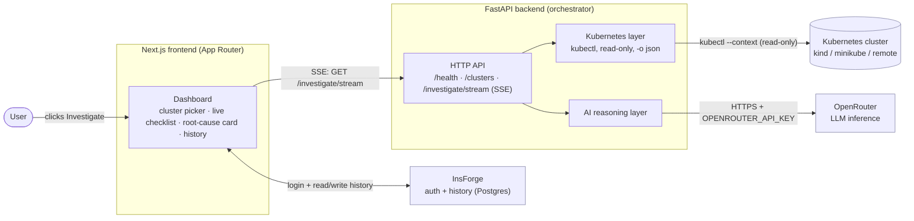
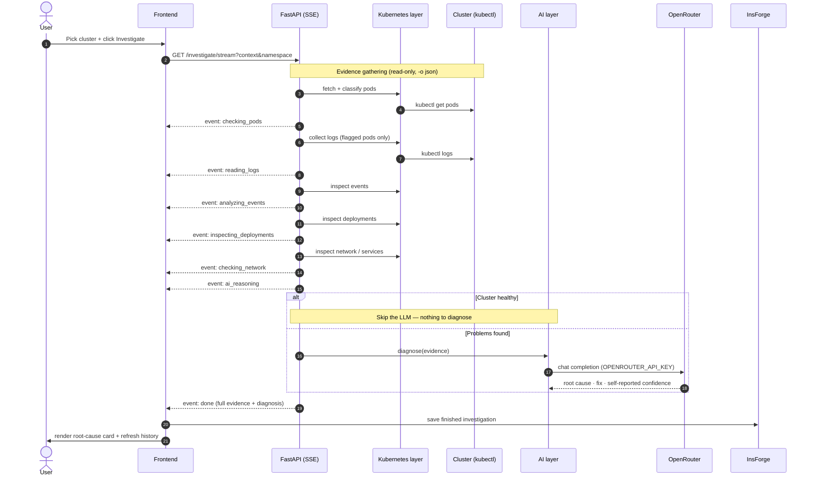
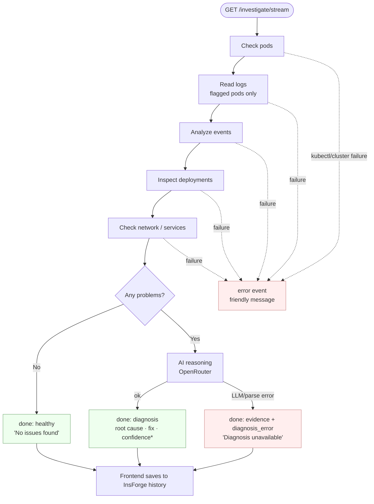
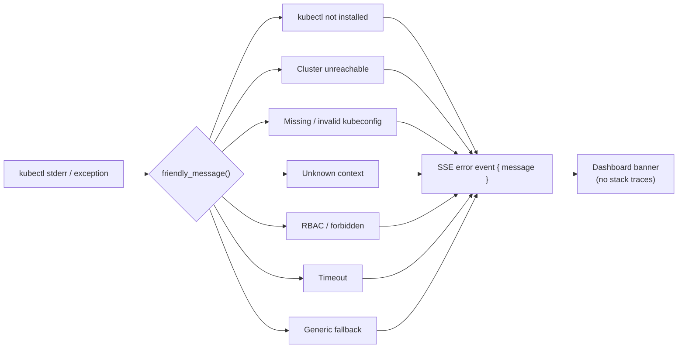

# Architecture

How the AI Kubernetes Agent is put together and how a single investigation flows
through it. For the *why* behind specific calls (SSE vs realtime, OpenRouter directly,
etc.) see [PLAN.md](PLAN.md); for standing rules see [CLAUDE.md](../CLAUDE.md).

> **One sentence:** a user clicks *Investigate*, the backend gathers read-only evidence
> from a cluster with `kubectl`, an LLM reasons over that evidence like a senior SRE,
> and the result is streamed back step-by-step and saved to history. There is **no**
> reconcile loop — every run is an explicit user action.

## System overview

**Key boundaries**

- **The frontend talks to two things:** the FastAPI backend (over SSE for an
  investigation) and InsForge directly (for auth and reading/writing history). InsForge
  is *not* in the investigation path.
- **The backend talks to two things:** the cluster (via `kubectl`, strictly read-only)
  and OpenRouter (directly, with `OPENROUTER_API_KEY`). The backend has no knowledge of
  InsForge.
- **Secrets stay server-side.** `OPENROUTER_API_KEY` lives only in the backend env.

## Investigation flow (end to end)

A single click runs this sequence. The backend emits one Server-Sent Event per step so
the UI can tick off a live checklist; the final `done` event carries the full diagnosis.

## Evidence pipeline & decision points

What happens inside the stream, including the healthy short-circuit and the failure
paths. The diagnosis is only ever **read** by the user — the agent never executes the
suggested `kubectl` command.

`*` Confidence is the **model's self-report**, not a calibrated probability — it is
labelled that way everywhere it appears.

## Reliability: failure → friendly message

Every cluster/`kubectl` failure is classified into user-facing copy in the backend; raw
stderr is logged but never shown. See [test-scenarios.md](test-scenarios.md) for how to
induce each case.

## Component reference

| Layer | Location | Responsibility |
|-------|----------|----------------|
| Frontend | [`frontend/`](../frontend) | Dashboard UI, SSE client ([`hooks/useInvestigation.ts`](../frontend/hooks/useInvestigation.ts)), InsForge auth + history ([`services/history.ts`](../frontend/services/history.ts)). |
| API / orchestrator | [`backend/app/api`](../backend/app/api), [`services/investigation.py`](../backend/app/services/investigation.py) | Routes and the step-by-step SSE stream. |
| Kubernetes layer | [`backend/app/kubernetes`](../backend/app/kubernetes) | `kubectl` executor (read-only allowlist, `-o json`) + inspectors; friendly error classifier. |
| AI layer | [`backend/app/ai`](../backend/app/ai) | OpenRouter client, prompt, and reasoner that turns evidence into a diagnosis. |
| Platform services | external | InsForge (auth + `investigations` table), OpenRouter (inference). |

## Test fixtures

The failure-scenario manifests under [`k8s-test/`](../k8s-test) intentionally create
broken resources (CrashLoopBackOff, ImagePullBackOff, OOMKilled, selector mismatch).
They are the **only** thing allowed to mutate a cluster, and they are applied **manually
by a human** — never by the agent.
